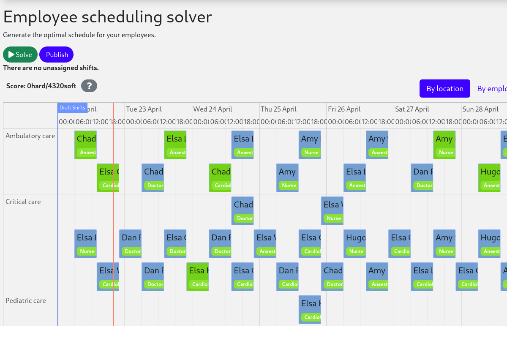

# Employee Scheduling (Python)

Schedule shifts to employees, accounting for employee availability and shift skill requirements.



- [Prerequisites](#prerequisites)
- [Run the application](#run-the-application)
- [Test the application](#test-the-application)

> [!TIP]
>   [Check out our off-the-shelf model for Employee Shift Scheduling](https://app.timefold.ai/models/employee-scheduling/v1). This model supports many additional constraints such as skills, pairing employees, fairness and more.

## Prerequisites

1. Install [Python 3.11+](https://www.python.org/downloads/).

2. Install JDK 17+, for example with [Sdkman](https://sdkman.io):

   ```sh
   $ sdk install java
   ```

## Run the application

1. Git clone the timefold-quickstarts repo and navigate to this directory:

   ```sh
   $ git clone https://github.com/TimefoldAI/timefold-quickstarts.git
   ...
   $ cd timefold-quickstarts/python/employee-scheduling
   ```

2. Create a virtual environment:

   ```sh
   $ python -m venv .venv
   ```

3. Activate the virtual environment:

   ```sh
   $ .venv\Scripts\Activate.ps1
   ```

4. Install the application:

   ```sh
   $ pip install -e .
   ```

5. Run the application:

   ```sh
   $ run-app
   ```

6. Visit [http://localhost:8000](http://localhost:8000) in your browser.

7. Click on the **Solve** button.

## Test the application

1. Run tests:

   ```sh
   $ pytest
   ```

## More information

Visit [timefold.ai](https://timefold.ai).
